### Nama : Brian Mohamad Safiudin
### NIM : 2141720133
### Kelas : TI-3A
### Vercel : https://nextjs-dashboard-kappa-ashy-95.vercel.app
---

# Praktikum 1: Setup Database

Pada praktikum ini, Anda akan menggunakan starter code yang sudah ada, lalu melakukan setup database dengan PostgreSQL menggunakan library `@vercel/postgres`.

## Soal 1
#### Capture hasil deploy project Anda dan buatlah laporan di file README.md. Jelaskan apa yang telah Anda pelajari?

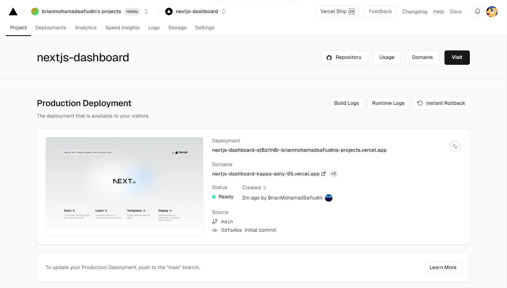

- `Penggunaan Template dan Repositori GitHub:` Memahami cara menggunakan template dalam GitHub untuk memulai project baru dan mengelola repositori.

- `Penggunaan Layanan Deployment Vercel:` Menggunakan Vercel sebagai layanan deployment untuk aplikasi web, termasuk pengaturan awal dan proses deploy.

## Soal 2
#### Capture hasil basis data Anda dan buatlah laporan di file README.md. Jelaskan apa yang telah Anda pelajari?

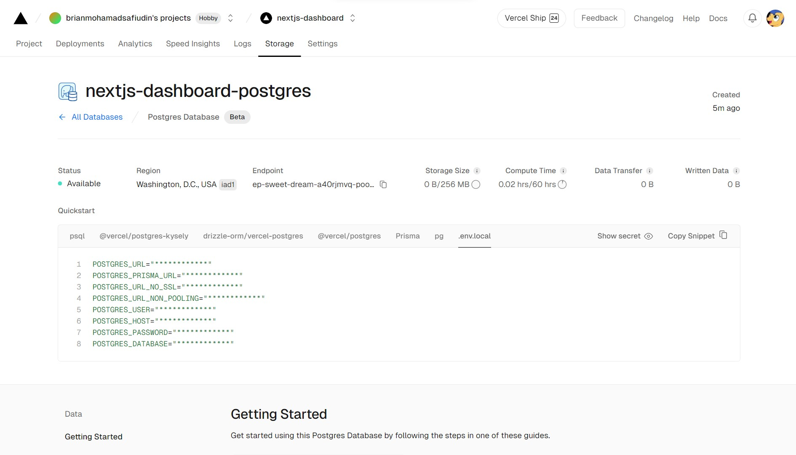

- `Pengaturan Basis Data PostgreSQL:` Memahami langkah-langkah untuk membuat basis data PostgreSQL menggunakan layanan Vercel.

- `Pemilihan Region:` tidak dapat mengubah region basis data ketika sudah proses inisialisasi. Jika ingin menggunakan region yang berbeda, harus pilih sebelum mulai membuat basis data.

- `Keamanan Konfigurasi:` Memastikan bahwa konfigurasi basis data tidak terekspos secara publik dengan cara mencantumkan file .env dalam .gitignore.

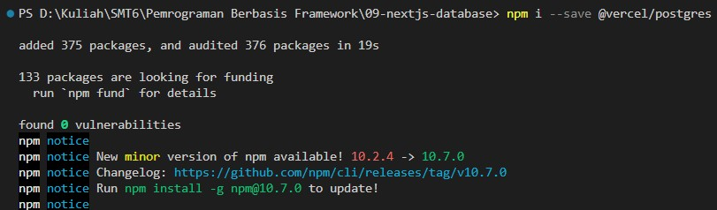

- `Instalasi SDK:` Menginstal SDK Vercel Postgres untuk memungkinkan aplikasi berinteraksi dengan basis data PostgreSQL yang sudah disiapkan.

## Soal 3
#### Capture hasil npm run seed Anda dan buatlah laporan di file README.md. Jelaskan apa yang telah Anda pelajari ?

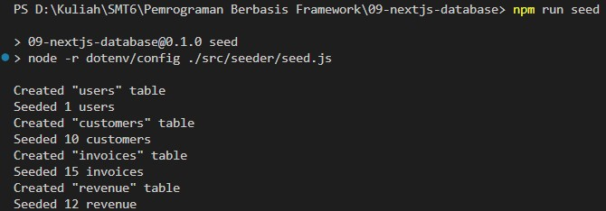

- `Seed Data:` Memahami konsep seed data untuk mengisi basis data dengan data awal yang dibutuhkan oleh aplikasi.

- `Penggunaan Skrip Seed:` Mengetahui cara menggunakan skrip untuk membuat tabel dan mengisi data ke dalam basis data menggunakan SQL.

- `Integrasi dengan PostgreSQL di Vercel:` Melakukan proses seed data ke basis data PostgreSQL yang sudah disiapkan di layanan Vercel.

- `Troubleshooting:` Mengatasi beberapa masalah umum seperti kekurangan modul, kesalahan path, atau kesalahan sintaks dalam skrip seed.

## Soal 4
#### Capture hasil query Anda dan buatlah laporan di file README.md. Jelaskan apa yang telah Anda pelajari ? Cobalah eksekusi query SQL yang lain sesuai kreasi Anda, capture hasilnya dan jelaskan!

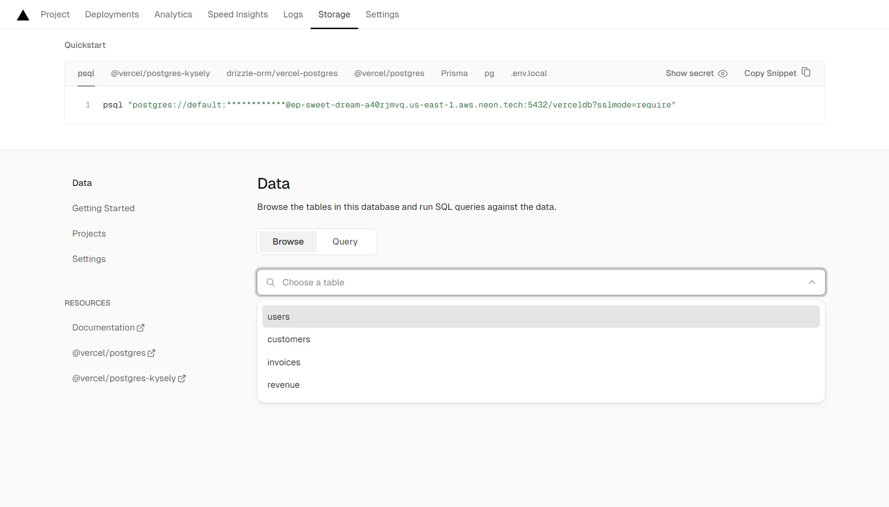

- `Eksplorasi Basis Data:` Menjelajahi tabel-tabel yang ada dalam basis data PostgreSQL di Vercel melalui antarmuka pengguna Vercel.
#

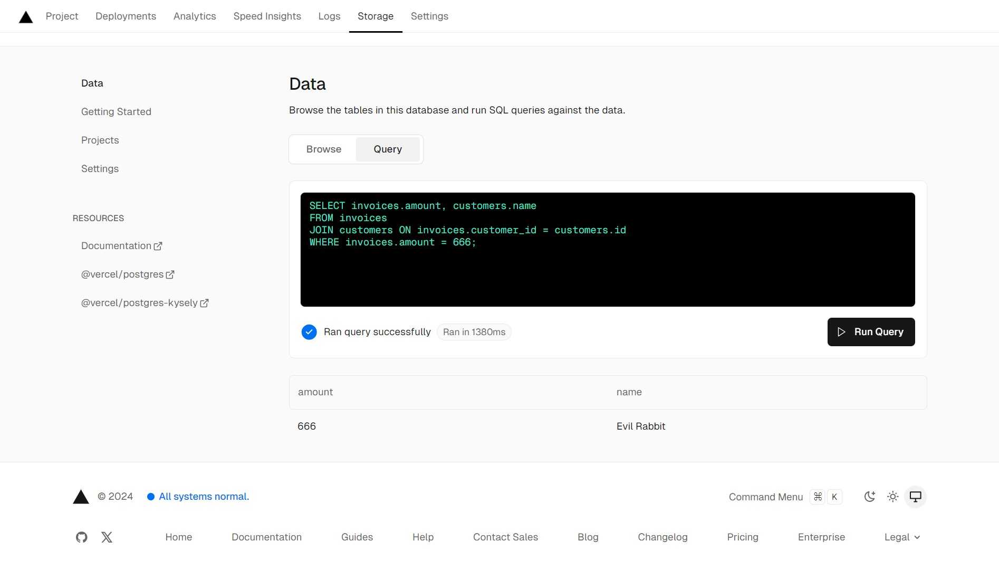

- `Eksekusi Query SQL:` Menggunakan antarmuka pengguna Vercel untuk mengeksekusi query SQL dan mendapatkan hasilnya.
#

```sql
SELECT invoices.amount, customers.name
FROM invoices
JOIN customers ON invoices.customer_id = customers.id
WHERE invoices.amount = 666;
```

- Pada contoh diatas, query digunakan untuk `menggabungkan tabel invoices dan customers` berdasarkan `customer_id dan id`, kemudian `menampilkan amount dan name` dari tabel tersebut yang dimana `amount = 666`.

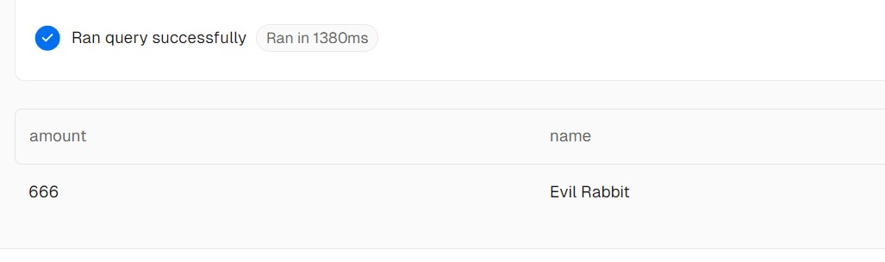

- `Pemahaman Struktur Tabel dan Relasi:` Memahami relasi antara tabel-tabel yang ada dalam basis data dan cara melakukan join untuk mengambil data dari beberapa tabel sekaligus.
---

# Praktikum 2: Fetching Data (API)

Pada praktikum ini, Anda dapat melanjutkan project dari praktikum 1 sebelumnya.

## Soal 5
#### Lakukan push, kemudian perhatikan di akun dashboard Vercel project Anda. Capture dan lampirkan link aplikasi Anda yang telah berhasil di deploy, kemudian buatlah laporan di file README.md. Jelaskan apa yang telah Anda pelajari ?

- Link: https://nextjs-dashboard-kappa-ashy-95.vercel.app 

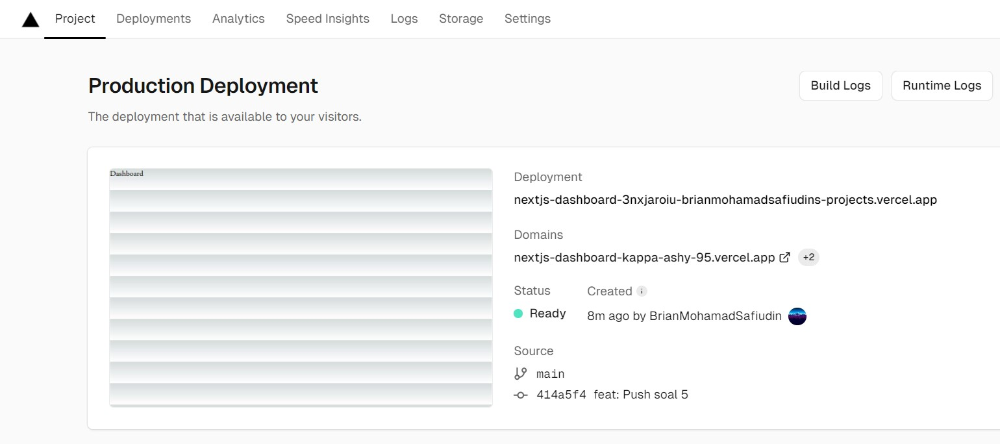

- `Struktur Folder Project:` Pentingnya memiliki struktur folder yang terorganisir untuk menyimpan berbagai jenis file, seperti model, utils, dan components.

- `Membuat Type Definitions:` Membuat tipe data di definitions.tsx yang menggambarkan bentuk dan tipe data dari berbagai entitas seperti User, Customer, Invoice, Revenue, dll. Ini penting untuk memastikan bahwa data yang diambil dari database memiliki struktur yang tepat.

- `Fetching Data dengan SQL:` Menggunakan sql dari @vercel/postgres untuk melakukan query ke database dan mengambil data yang diperlukan. Fungsi seperti fetchRevenue, fetchLatestInvoices, dan fetchCardData digunakan untuk mendapatkan data dari berbagai tabel dan menggabungkannya jika diperlukan.

- `Menghindari Caching Data:` Untuk memastikan data yang diambil selalu up-to-date, menggunakan noStore() yang setara dengan fetch(..., {cache: 'no-store'}) untuk mencegah caching response.

- `Menggunakan Utility Functions:` Membuat utility functions di utils.tsx seperti formatCurrency untuk format mata uang, formatDateToLocal untuk format tanggal, generateYAxis untuk menghasilkan label sumbu Y pada grafik, dan generatePagination untuk membuat pagination dinamis.

- `Membuat Komponen Atom dan Molekul:` Membuat komponen atom untuk font di atoms/fonts.tsx dan beberapa komponen molekul seperti card.tsx, latest-invoices.tsx, dan revenue-chart.tsx. Ini membantu dalam membangun UI yang modular dan mudah di-maintain.

- `Mengintegrasikan Komponen di Halaman Utama:` Mengintegrasikan komponen-komponen tersebut di halaman utama (page.tsx) dan menggunakan data yang telah difetch untuk menampilkan informasi dalam bentuk kartu, grafik pendapatan, dan daftar faktur terbaru.

## Soal 6
#### Lakukan capture dan push hasilnya, kemudian buatlah laporan di file README.md. Jelaskan apa yang telah Anda pelajari ?

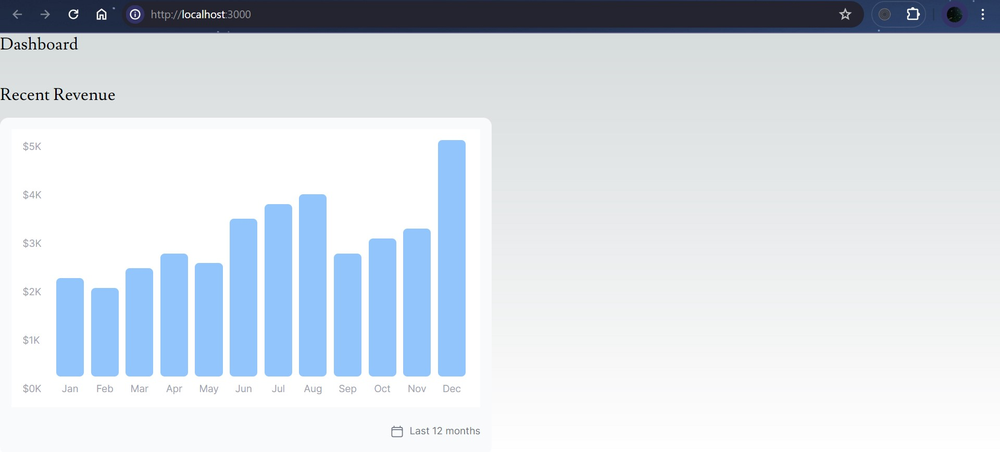

- `Pengaturan Grid dan Flexbox:` Menggunakan grid CSS dan flexbox untuk mengatur tata letak dalam halaman web. Ini meliputi pengaturan sumbu x dan y, serta penempatan elemen-elemen di dalamnya.

- `Penanganan Masalah Tata Letak:` Menangani masalah tata letak yang umum terjadi, seperti ketidaksejajaran antara elemen-elemen dalam grid atau flexbox.

- `Penggunaan Properti CSS:` Properti CSS seperti width dan flex dapat digunakan untuk mengontrol tampilan dan perilaku elemen-elemen dalam tata letak.

## Soal 7
#### Lakukan capture dan push hasilnya, kemudian buatlah laporan di file README.md. Jelaskan apa yang telah Anda pelajari ?

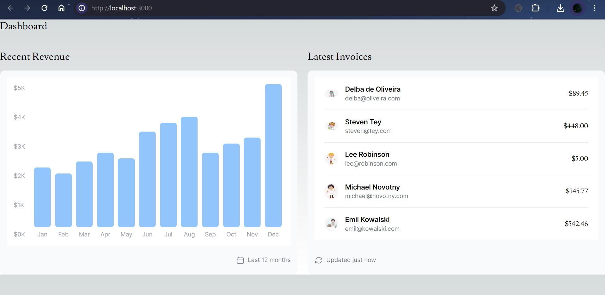

- Kueri SQL yang digunakan untuk `mengambil 5 invoices terakhir` adalah contoh konkret bagaimana cara membatasi jumlah data yang diambil langsung dari basis data. Ini dilakukan dengan menggunakan klausa `ORDER BY` untuk mengurutkan data berdasarkan tanggal dalam urutan menurun dan `LIMIT 5` untuk membatasi hasilnya.

- Penggunaan await sql`<LatestInvoiceRaw>` menunjukkan bagaimana mengintegrasikan kueri SQL dalam file TypeScript untuk mengambil data dari basis data dan bagaimana hasilnya dapat diolah lebih lanjut dalam aplikasi.

- Kueri SQL yang diberikan menunjukkan penggunaan `JOIN` untuk menggabungkan data dari tabel `invoices` dan `customers`. Ini penting untuk mendapatkan data yang lebih lengkap dan relevan dari beberapa tabel basis data.

- Jika gambar profil tidak muncul, ini bisa disebabkan karena aset gambar yang tidak ada. Memastikan semua aset gambar tersedia dan ditempatkan pada path yang benar `(public\customers\...)` adalah langkah penting untuk memastikan gambar dapat di-load dengan benar.
---

# Tugas Praktikum
#### 1. Jika Anda perhatikan pada file src\app\page.tsx untuk komponen Card sebenarnya telah dibuat sebagai molecules pada file src\app\components\molecules\card.tsx yaitu komponen CardWrapper, silakan Anda sesuaikan.

- Mengubah nama komponen `Card` menjadi `CardWrapper` di file src\app\page.tsx.

```tsx
import CardWrapper from "@/app/components/molecules/card"
```

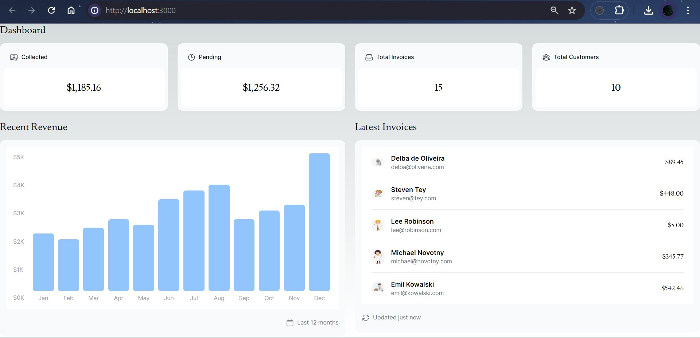

#### 2. Perhatikan fungsi fetchCardData() (pada file src\model\query.tsx) dari soal nomor 1. Jelaskan maksud kode dan kueri yang dilakukan dalam fungsi tersebut!

- Fungsi `fetchCardData()` mengumpulkan data penting dari tabel invoices dan customers untuk ditampilkan di dashboard. Fungsi ini menggunakan beberapa kueri SQL untuk menghitung jumlah faktur, jumlah pelanggan, dan total nilai faktur berdasarkan statusnya. Dengan menjalankan kueri secara paralel dan memastikan respons tidak disimpan dalam cache, fungsi ini memberikan data terbaru dan efisien.

- Fungsi `noStore()` digunakan untuk mencegah response dari fungsi ini disimpan dalam cache. Ini memastikan bahwa data yang diambil selalu yang terbaru setiap kali fungsi ini dipanggil.

- `invoiceCountPromise:` Menghitung jumlah total faktur (invoices) dalam tabel invoices.

- `customerCountPromise:` Menghitung jumlah total pelanggan (customers) dalam tabel customers.

- `invoiceStatusPromise:` Menghitung jumlah total nilai faktur yang sudah dibayar (paid) dan yang masih pending (pending) dalam tabel invoices. Dua SUM digunakan untuk mengakumulasi nilai berdasarkan status faktur.

- `Promise.all` digunakan untuk menjalankan ketiga kueri secara paralel. Ini membantu mengoptimalkan waktu respons dengan mengeksekusi semua kueri secara bersamaan.

- `numberOfInvoices:` Mengambil jumlah faktur dari hasil kueri pertama dan mengonversinya menjadi angka.

- `numberOfCustomers:` Mengambil jumlah pelanggan dari hasil kueri kedua dan mengonversinya menjadi angka.

- `totalPaidInvoices:` Mengambil jumlah total faktur yang sudah dibayar dari hasil kueri ketiga, kemudian memformatnya sebagai mata uang menggunakan fungsi formatCurrency.

- `totalPendingInvoices:` Mengambil jumlah total faktur yang masih pending dari hasil kueri ketiga, kemudian memformatnya sebagai mata uang menggunakan fungsi formatCurrency.
